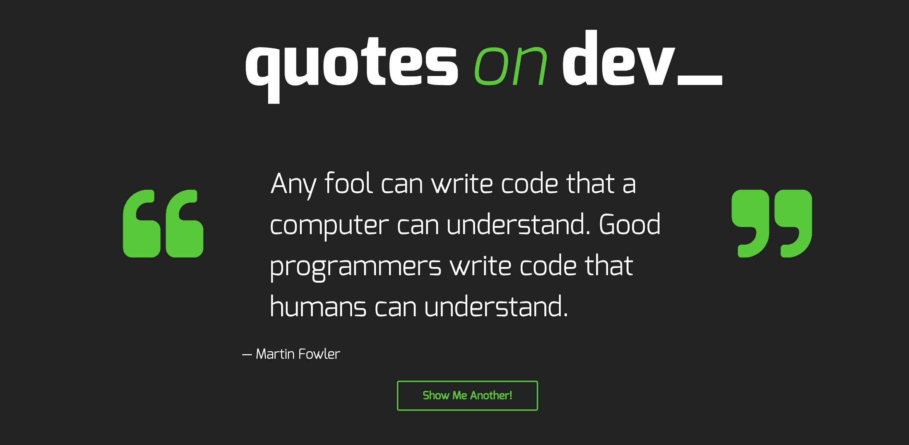
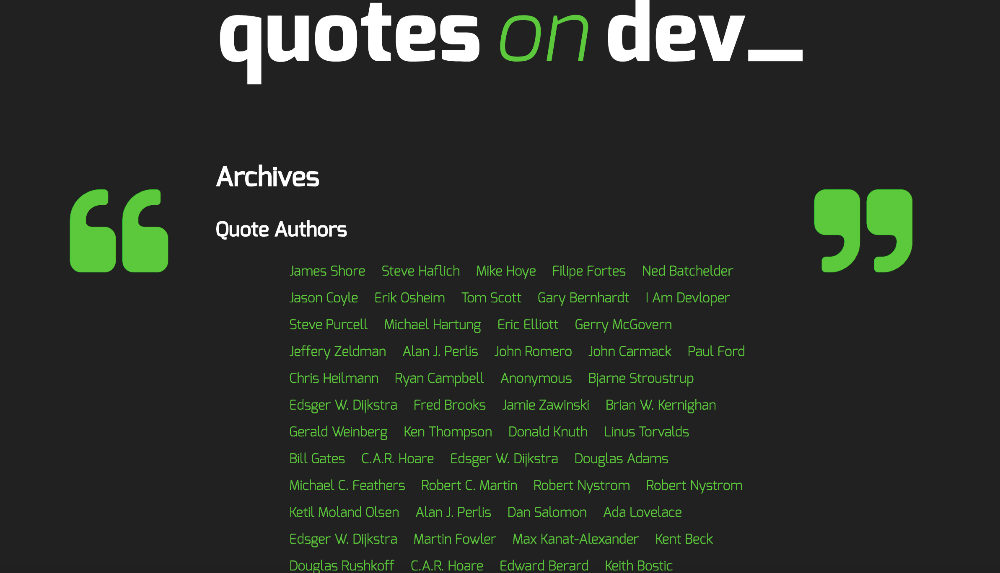
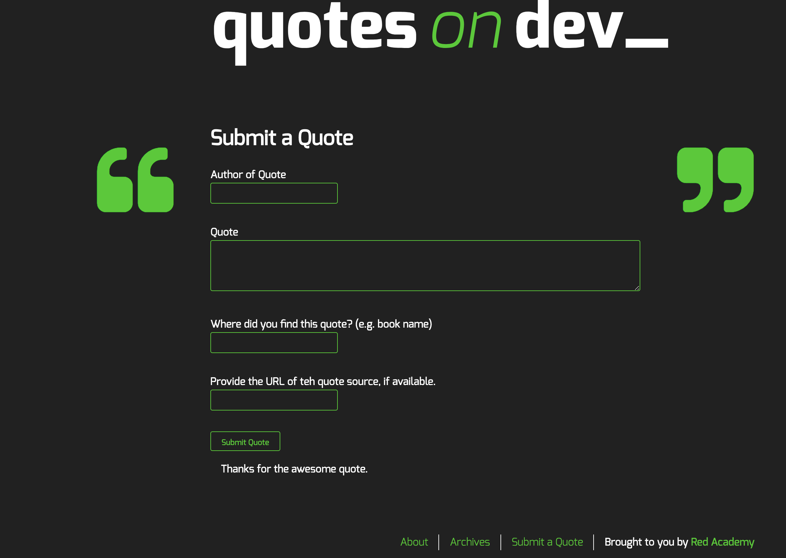

# Quotes on Dev Starter

A WordPress starter theme for the Quotes on Dev project, forked from Underscores.

## Installation

### 1. Download me (don't clone me!)

Then add me to your `wp-content/themes` directory.

### 2. Rename the `quotesondev-starter-master` directory

Make sure that the theme directory name is project appropriate! Do you need `starter` or `master` in the directory name?

### 3. Install the dev dependencies

Next you'll need to run `npm install` **inside your theme directory** to install the npm packages you'll need for Gulp, etc.

### 4. Update the proxy in `gulpfile.js`

Lastly, be sure to update your `gulpfile.js` with the appropriate URL for the Browsersync proxy (so change `localhost[:port-here]/[your-dir-name-here]` to the appropriate localhost URL).

And now would be a good time to `git init` :)

## Technology Used

* Gulp
* Wordpress
* JQuery
* HTML & SCSS
* PHP
* JavaScript
* Wordpress Rest API
* Ajax

## Personal learning

Create a website that shoots out random quotations when clicked on another button. Submit a Quote when we logged in and validate a quote when its submitted. The website is fully responsive to mobile, tablet, and desktop. It is handled by API Ajax calls. It was fun project and shows the progress we can reached in creating themes and website since project one. 

